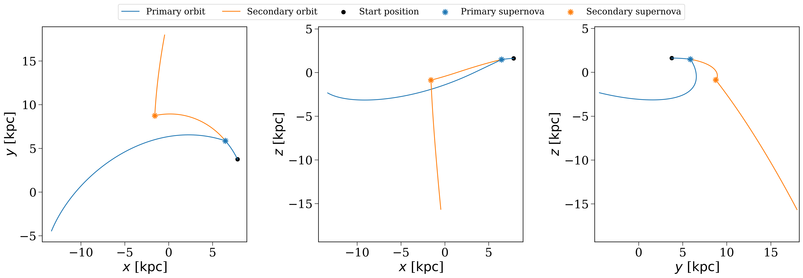

Part 1: Creating your first population
--------------------------------------

``cogsworth`` is an object-oriented code, and the main object that you'll interact with is the :class:`~cogsworth.pop.Population` object. This is the class that creates and evolves a population of stars and binaries, and also tracks their properties and events (like supernovae and binary neutron star mergers) over time.

Demo
****

Initialising a Population
^^^^^^^^^^^^^^^^^^^^^^^^^

The most basic population you can create looks like this:

.. code-block:: python

    p = cogsworth.pop.Population(
        n_binaries=100,
        use_default_BSE_settings=True
    )

.. margin::

    The actual number of binaries may be slightly higher than what you request due to the way the code samples the initial conditions (rejection sampling). You can always pass

    .. code-block:: python

        sampling_params={'trim_extra_samples': True}

    to the :class:`~cogsworth.pop.Population` constructor to ensure that the exact number of binaries you request are created.

This creates a population of *at least* 1000 binaries. By default ``cogsworth`` assumes you want to evolve stars in the Milky Way and therefore uses a Milky Way-like star formation history (:class:`~cogsworth.sfh.Wagg2022`) and a galactic gravitational potential fit to the Milky Way (:class:`~gala.potential.potential.MilkyWayPotential`).

Sampling binaries
^^^^^^^^^^^^^^^^^

We can start to sample and evolve this population. First, we use :meth:`~cogsworth.pop.Population.sample_initial_binaries` to sample the initial binaries using :mod:`cosmic` and draw their birth times and initial kinematics from the star formation history model.

.. code-block:: python

    # perform initial sampling
    p.sample_initial_binaries()

    # take a look at the first first binaries
    print(p.initial_binaries.head())

    # inspect their initial galactic properties
    print(p.initial_galaxy)
    print(p.initial_galaxy.positions)
    print(p.initial_galaxy.tau)

Performing stellar evolution
^^^^^^^^^^^^^^^^^^^^^^^^^^^^

After this point, it's time to actually evolve the binaries. For this, we use :meth:`~cogsworth.pop.Population.perform_stellar_evolution`. This function uses :mod:`cosmic` to evolve the binaries from their birth until the present day.

.. code-block:: python

    # evolve the binaries
    p.perform_stellar_evolution()

    # take a look at the evolution of the first few binaries
    print(p.bpp.loc[:5])

    # same for the supernova natal kicks (this will be zero for low-mass stars that don't explode)
    print(p.natal_kicks.loc[:5])

If you want to look at the final state of the binaries at the present day, you can use the :attr:`~cogsworth.pop.Population.final_bpp` attribute, which is the final bpp row for each binary.

.. code-block:: python

    # look at the final state of the first few binaries
    print(p.final_bpp.loc[:5])

Integrating galactic orbits
^^^^^^^^^^^^^^^^^^^^^^^^^^^

Finally, we can couple this to the galactic dynamics by integrating the orbits of the binaries through the galaxy using :mod:`gala`. This is done with :meth:`~cogsworth.pop.Population.perform_galactic_evolution`.

.. code-block:: python

    # integrate the orbits of the binaries through the galaxy
    p.perform_galactic_evolution()

    print(p.orbits[:5])

Quick recap
^^^^^^^^^^^

This class now stores the data for the whole simulation, everything from the initial conditions of the binaries, to their properties at each timestep of evolution. To summarise, we have just:

* Sampled the initial binaries from :mod:`cosmic`
* Drawn their initial kinematics and birth times from the star formation history model
* Evolved the binaries from birth until present day using :mod:`cosmic`
* Integrated the orbits of the binaries through the galaxy using :mod:`gala`

.. code-block:: python

    # in future cases, you can achieve all of this with a single line of code!
    p.create_population()

Inspecting the most massive binary
^^^^^^^^^^^^^^^^^^^^^^^^^^^^^^^^^^

Let's take a moment to inspect the most massive binary in the population. We can find it by looking at the initial mass of the primary star in each binary and finding the index of the maximum value.

.. tip::

    Each binary in a :class:`~cogsworth.pop.Population` is assigned a unique binary number (``bin_num``) that serves as an identifier for that binary throughout the simulation. This allows us to easily track the properties and evolution of specific binaries across different tables and data structures within the population.

Let's find the ``bin_num`` of the most massive binary and then look at its properties in the different tables.

.. code-block:: python

    # find the bin_num of the most massive binary
    most_massive = p.bin_nums[p.initial_binaries["mass_1"].argmax()]

    # look at its properties in the bpp table
    print(p.bpp.loc[most_massive])

    # look at its natal kick information
    print(p.kick_info.loc[most_massive])

Wowwww - lots of numberssss! This isn't quite so easy to parse, so let's turn this into a cartoon evolution plot to get a better visual picture of what's going on with this binary.

.. code-block:: python

    # plot a cartoon of its evolution
    p.plot_cartoon_binary(bin_num=most_massive)

That should give you something like this:

.. figure:: ../../../_static/astronuc/cartoon_binary.png
    :align: center
    :width: 80%

    Cartoon evolution of the most massive binary in the population.

We can also look at the orbit of this binary through the galaxy. By default, the :meth:`~cogsworth.pop.Population.plot_orbit` method plots the orbit from birth until present day, but you can also specify a custom time range.

.. code-block:: python

    # plot the orbit of the most massive binary
    p.plot_orbit(bin_num=most_massive)

    # plot the same orbit but only for the first 100 Myr of evolution
    p.plot_orbit(bin_num=most_massive, t_max=100 * u.Myr)

And those plots might look something like this:

.. figure:: ../../../_static/astronuc/orbit_full.png
    :align: center
    :width: 80%
    
    Orbit of the most massive binary from birth until present day

    
    Orbit of the most massive binary for the first 100 Myr of evolution

.. raw:: html

    

Tasks
*****

Now it's your turn! Try the following tasks to get familiar with creating and inspecting populations in ``cogsworth``.

Your own population
^^^^^^^^^^^^^^^^^^^

.. admonition:: Task 1.1
    :class: admonition-task

    To start, initialise a population with 1000 binaries, then sampling the binaries, evolve them, and integrate their orbits.

    What are the initial properties of the first few binaries in the population?

    .. dropdown:: Click here to show the answer
        :color: danger

        .. code-block:: python

            # create a population with 1000 binaries
            p = cogsworth.pop.Population(
                n_binaries=1000, use_default_BSE_settings=True
            )
            p.create_population()

            # look at the first few binaries
            print(p.initial_binaries.head())

Distributions
^^^^^^^^^^^^^

.. admonition:: Task 1.2
    :class: admonition-task

    Now let's make some plots. First, what does **the distribution of galactic birth times** look like for the binaries in the population?

    .. dropdown:: Hint
        :color: info

        You can find the birth times of the binaries in the ``initial_galaxy`` attribute of the population. The birth times are stored in the ``tau`` attribute of the galaxy and are ''lookback times'', meaning that a birth time of 0 corresponds to a binary that was born at the present day, while a birth time of 10 Gyr corresponds to a binary that was born 10 Gyr ago.

    .. dropdown:: Click here to show the answer
        :color: danger

        .. code-block:: python

            fig, ax = plt.subplots()
            ax.hist(p.initial_galaxy.tau.to(u.Gyr).value, bins="auto")
            ax.set(
                xlabel="Lookback time [Gyr]",
                ylabel="Number of binaries",
            )
            plt.show()

        .. figure:: ../../../_static/astronuc/formation_times.png
            :align: center
            :width: 80%

            Distribution of galactic birth times for the binaries in the population.

Your favourite binary
^^^^^^^^^^^^^^^^^^^^^

.. admonition:: Task 1.3
    :class: admonition-task

    Now pick a binary of interest to you and inspect its evolution with a cartoon plot and look at its orbit through the galaxy.

    Some inspiration for picking a binary:

    - The most massive binary in the population
    - A binary that ends by creating at least one neutron star
    - A random binary!

    Since this is a "choose your own adventure", use the tabs below for what you chose.

    .. tab-set::

        .. tab-item:: Most massive binary

            .. dropdown:: Hint
                :color: info

                You can find the most massive binary by looking at the initial mass of the primary star in each binary and finding the index of the maximum value. Remember that each binary has a unique ``bin_num`` that you can use to track it across different tables and plots.

            .. dropdown:: Click here to show the answer
                :color: danger

                .. code-block:: python

                    # find the bin_num of the most massive binary
                    most_massive = p.bin_nums[p.initial_binaries["mass_1"].argmax()]

                    # make some plots
                    p.plot_cartoon_binary(bin_num=most_massive)
                    p.plot_orbit(bin_num=most_massive)

        .. tab-item:: Neutron star

            .. dropdown:: Hint
                :color: info

                You can find binaries that create neutron stars by looking at the ``kstar_1`` and ``kstar_2`` columns in the bpp table, which give the stellar type of each star at each timestep. A stellar type of 13 corresponds to a neutron star.

                Remember that the :attr:`~cogsworth.pop.Population.final_bpp` table shows the final state of the binaries at the present day.

            .. dropdown:: Click here to show the answer
                :color: danger

                .. code-block:: python

                    # find binaries that create at least one neutron star
                    neutron_star_binaries = p.final_bpp[
                        (p.final_bpp["kstar_1"] == 13) | (p.final_bpp["kstar_2"] == 13)
                    ]

                    # pick the first one and get its bin_num
                    ns_bin_num = neutron_star_binaries["bin_num"].iloc[0]

                    # make some plots
                    p.plot_cartoon_binary(bin_num=ns_bin_num)
                    p.plot_orbit(bin_num=ns_bin_num)

        .. tab-item:: Random binary
        
            .. dropdown:: Click here to show the answer
                :color: danger

                .. code-block:: python

                    # pick a random binary
                    random_bin_num = np.random.choice(p.bin_nums)

                    # make some plots
                    p.plot_cartoon_binary(bin_num=random_bin_num)
                    p.plot_orbit(bin_num=random_bin_num)

        .. tab-item:: Something else

            You'll have to ask Tom if you want a hint/answer for this!

And now it's time to move on to Part 2, where we'll learn how to identify specific types of objects in the population and make some more plots!