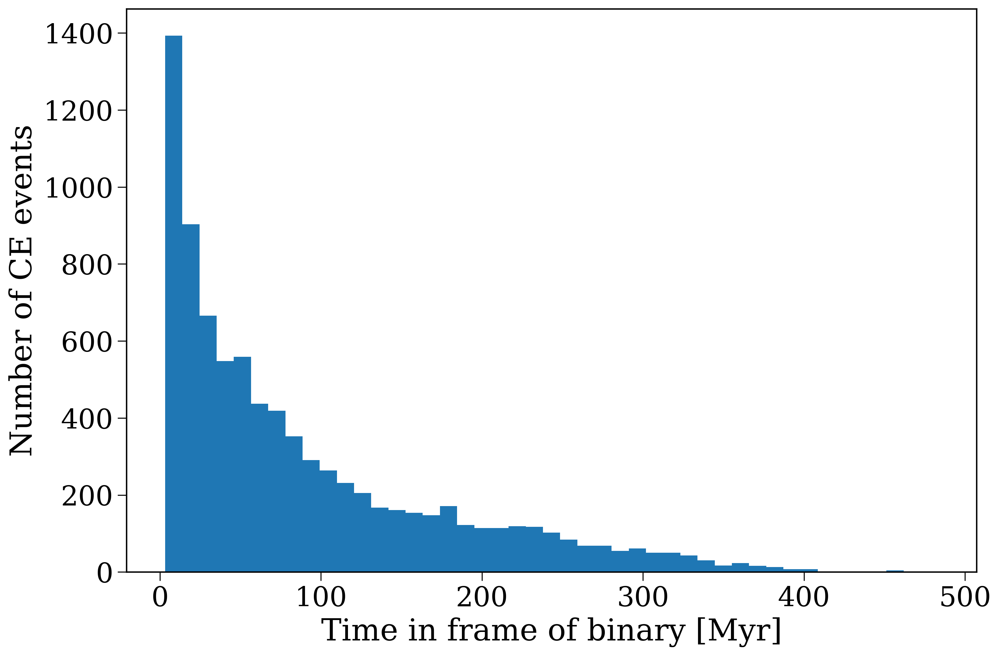
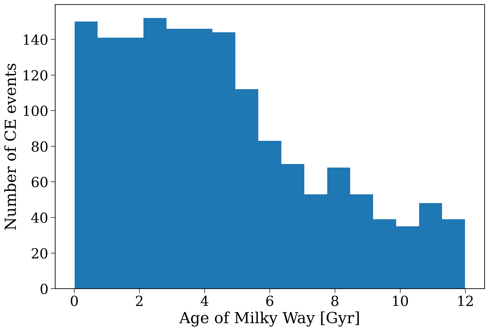
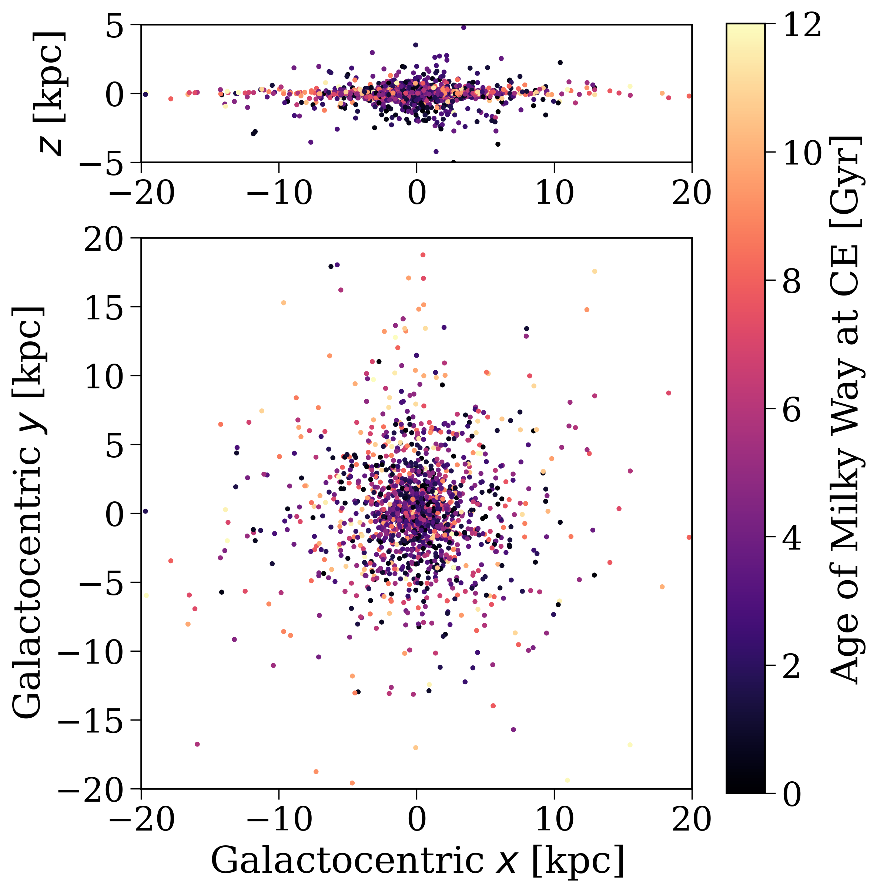

Part 3: Investigate the supernovae
----------------------------------

Now that we can simulate Populations of binaries and identify specific subpopulations, it's time to track down those supernovae! I'll start with a demo of how to do this for common-envelope events and then you'll get a chance to do the same for supernovae.

Demo
****

Create a population with lots of massive stars
^^^^^^^^^^^^^^^^^^^^^^^^^^^^^^^^^^^^^^^^^^^^^^

First things first, let's make a slightly different population, which preferentially samples higher mass binaries. This will give us more common-envelopes and supernovae to work with.

.. margin::

    Note that this population still stores the total mass in binaries and singles stars required to create this population (in the :attr:`~cogsworth.pop.Population.mass_binaries` and :attr:`~cogsworth.pop.Population.mass_singles` attributes). So you can renormalise without worrying that you've preferentially sampled from the IMF.

.. code-block:: python

    import cogsworth

    p = cogsworth.pop.Population(
        n_binaries=10_000,
        use_default_BSE_settings=True,
        final_kstar1=[13, 14],          # aim to sample systems that produce a NS/BH
        final_kstar2=[13, 14],          # same for secondary star
    )
    p.create_population()

Find the common-envelope events
^^^^^^^^^^^^^^^^^^^^^^^^^^^^^^^

Our goal here is to find the times at which common-envelope events occur in our population. The table of interest in this case is the ``bpp`` table, which tracks the properties of each binary at every "important" time step in the simulation.

.. tip::

    The :ref:`output documentation <output>` has a detailed description of (a) what different ``evol_type`` and ``kstar`` values mean and (b) definitions of every column in the ``bpp`` table. I recommend keeping this documentation open as you work through this part of the lab.

Common-envelope events are indicated by an ``evol_type`` value of 7. Any row with this value corresponds to the start of a common-envelope event. Let's find these rows!

.. code-block:: python

    # find the times at which a common-envelope event starts
    ce_mask = p.bpp["evol_type"] == 7

    # mask the rows in the Pandas DataFrame
    ce_rows = p.bpp[ce_mask]
    print(ce_rows)

We can now take a look at the distribution of times at which these events occur.

.. code-block:: python

    fig, ax = plt.subplots()
    ax.hist(ce_rows["tphys"], bins="auto")
    ax.set(
        xlabel="Time in frame of binary [Myr]",
        ylabel="Number of common-envelope events",
    )
    plt.show()

    Distribution of common-envelope event times in the frame of the binary.

It's important to note here that these times are in the frame of the binary, so they don't correspond to any particular time in the galaxy. We'll see how to convert these to galactic times next.

.. admonition:: Question for you
    :class: admonition-question

    What drives the timing of these common-envelope events?
    
    What would happen if you made a scatter plot of these times against the initial primary mass of the binary? Or the initial orbital period?

    .. dropdown:: Click here to reveal the answer
        :color: danger

        A common-envelope event occurs when a star overflows its Roche lobe in an unstable manner. So if we simplify a little, the timing is mainly driven by:
        
        (a) when the star evolves off the main sequence and expands 
        (b) how far apart the stars are
        (c) how large the Roche lobe is (which depends on the mass ratio).
        
        It's a little more complicated in practice, since the typically stability of mass transfer is different depending on the evolutionary stage of the star when it overflows its Roche lobe (case A, B, or C).

        But in general, we would expect common-envelope events to occur sooner for higher mass stars since those will expand sooner. We would also expect common-envelope events to be more common and to occur faster for shorter initial orbital periods.

    

Compute the timing on Galactic timescales
^^^^^^^^^^^^^^^^^^^^^^^^^^^^^^^^^^^^^^^^^

Now let's try converting these times to the galactic frame. Each binary was born at a specific time in the galaxy, which is given by the :attr:`~cogsworth.sfh.StarFormationHistory.tau` attribute of the :attr:`~cogsworth.pop.Population.initial_galaxy` object. Remember that this is a "lookback time", so the binary was born :math:`\tau` Myr before the present day. So to convert the common-envelope event times to the galactic frame, we can do the following:

.. math::

    t_{\rm gal} = t_{\rm present} - \tau + t_{\rm ce}

where :math:`t_{\rm ce}` is the time of the common-envelope event in the binary frame and :math:`t_{\rm present}` is the present day time in the galaxy (which is 12 Gyr by default, but is stored in the :attr:`~cogsworth.pop.Population.max_ev_time` attribute).

Let's try computing the times of the common-envelope events in the galactic frame!

.. code-block:: python

    # get the bin_nums of the common-envelope events
    ce_bin_nums = ce_rows["bin_num"]

    # get the indices of these bin_nums in the p.bin_nums array
    ce_indices = np.searchsorted(p.bin_nums, ce_bin_nums)

    # use these indices to get tau
    ce_tau = p.initial_galaxy.tau[ce_indices]

    # compute the galactic times
    ce_t_gal = p.max_ev_time - ce_tau + ce_rows["tphys"].values * u.Myr

Let's take a look at the distribution of these galactic times!

.. code-block:: python

    fig, ax = plt.subplots()
    ax.hist(ce_t_gal.to(u.Gyr).value, bins="auto")
    ax.set(
        xlabel="Age of Milky Way [Gyr]",
        ylabel="Number of CE events",
    )
    plt.show()

    Distribution of common-envelope event times in the frame of the galaxy.

.. admonition:: Question for you
    :class: admonition-question

    What drives the distribution of timing of these common-envelope events on Galactic timescale?
    
    .. dropdown:: Click here to reveal the answer
        :color: danger

        The timing in the frame of the binary is relatively short on the scale of the galaxy (most occur within 100 Myr, see earlier plot). So the main driver of the distribution on galactic timescales is the star formation history of the galaxy. In this case, we have a Milky Way-like SFH, which means that most stars (and therefore most common-envelope events) occur early on in the galaxy's history, which is why we see a peak at early times in the histogram.

Locate the common-envelope events in the galaxy
^^^^^^^^^^^^^^^^^^^^^^^^^^^^^^^^^^^^^^^^^^^^^^^

As we've seen before, each binary has an ``orbit`` associated with it, which tracks its trajectory through the galaxy. Let's take a look at one of these objects to get a sense of what a ``gala`` :class:`~gala.dynamics.Orbit` object looks like.

.. code-block:: python

    # let's take the first orbit
    orbit_example = p.orbits[0]
    print(orbit_example)

    # it stores the time and position at each timestep
    print(orbit_example.t)
    print(orbit_example.pos.xyz)

Did you notice that the orbit times end at 12 Gyr? The initial time of the orbit is actually the birth time of the binary in the galaxy, these orbit times are already based in the Galactic frame.

So we need to:

- Go through each of the common-envelope events
- Find the corresponding orbit
- Compute the last timestep just before the common-envelope
- Get the position of the binary at this time

Let's do it!

.. code-block:: python

    ce_positions = np.zeros((len(ce_rows), 3)) * u.kpc

    # go through each of the common-envelope events
    for i in range(len(ce_indices)):
        # find the corresponding orbit
        ce_orbit = p.orbits[ce_indices[i]]

        # compute the last timestep where orbit.t is less than ce_t_gal[i]
        closest_time_index = np.where(ce_orbit.t < ce_t_gal[i])[0][-1]

        # get the position of the binary at this time
        ce_positions[i] = ce_orbit.pos.xyz[:, closest_time_index]

And now we can plot the positions of these common-envelope events in the galaxy!

.. code-block:: python

    fig, axes = plt.subplots(2, 1, figsize=(8, 9), gridspec_kw={"height_ratios": [1, 4]})

    XMAX = 20
    ZMAX = 5

    axes[0].scatter(
        ce_positions[:, 0], ce_positions[:, 2],
        c=ce_t_gal.to(u.Gyr).value, s=5,
        cmap="magma", vmin=0, vmax=12
    )
    axes[0].set(
        ylabel="$z$ [kpc]",
        xlim=(-XMAX, XMAX),
        ylim=(-ZMAX, ZMAX),
        aspect="equal",
    )

    axes[1].scatter(
        ce_positions[:, 0], ce_positions[:, 1],
        c=ce_t_gal.to(u.Gyr).value, s=5,
        cmap="magma", vmin=0, vmax=12
    )
    axes[1].set(
        xlabel="Galactocentric $x$ [kpc]",
        ylabel="Galactocentric $y$ [kpc]",
        xlim=(-XMAX, XMAX),
        ylim=(-XMAX, XMAX),
        aspect="equal",
    )

    fig.colorbar(axes[0].collections[0], ax=axes, label="Age of Milky Way at CE [Gyr]")

    plt.show()

    Positions of common-envelope events in the galaxy. The colour indicates the age of the Milky Way at which the common-envelope event occurs.

.. raw:: html

    

Tasks
*****

Now it's your turn to do the same for supernovae! The code from the demo above should be helpful for this :)

.. admonition:: Task 3.1
    :class: admonition-task

    Create a population like the one above (~10000 binaries, that preferentially samples higher mass binaries). Write a mask for the ``bpp`` table that selects only the rows corresponding to supernova events. Note that supernovae are labelled as either ``evol_type == 15`` (primary star supernova) or ``evol_type == 16`` (secondary star supernova).

    It will be useful to know whether a supernova corresponds to the primary or secondary star, so create two separate masks for these.

    .. dropdown:: Click here to reveal the answer
        :color: danger
        
        .. code-block:: python

            import cogsworth

            p = cogsworth.pop.Population(
                n_binaries=10_000,
                use_default_BSE_settings=True,
                final_kstar1=[13, 14],          # aim to sample systems that produce a NS/BH
                final_kstar2=[13, 14],          # same for secondary star
            )
            p.create_population()
            
            primary_sn = p.bpp["evol_type"] == 15
            secondary_sn = p.bpp["evol_type"] == 16
            sn_mask = primary_sn | secondary_sn

.. admonition:: Task 3.2
    :class: admonition-task

    Now make a histogram that shows the distribution of supernova times in the frame of the binary. Ensure to create separate histograms for primary and secondary supernovae.

    Use the same bins for both histograms and set ``density=True`` in both calls to ``plt.hist`` so that you can compare the shapes of the distributions and not just the number of supernovae.

    What do you notice about the timing of primary vs. secondary supernovae? Are they the same? Why/why not?

    .. dropdown:: Hint
        :color: info

        Try constructing the bins before you call ``plt.hist``. You can use ``np.linspace`` to create an array of bin edges that go from 0 to 200 Myr (since most supernovae occur within this time frame) and have, say, 40 bins.

        .. code-block:: python

            bins = np.linspace(0, 200, 40)

    .. dropdown:: Click here to reveal the answer
        :color: danger

        .. code-block:: python

            bins = np.linspace(0, 200, 40)

            fig, ax = plt.subplots()

            ax.hist(p.bpp["tphys"][primary_sn], bins=bins, density=True, label="Primary SN")
            ax.hist(p.bpp["tphys"][secondary_sn], bins=bins, alpha=0.7, density=True, label="Secondary SN")
            ax.set(
                xlabel="Time in frame of binary, $t_b$ [Myr]",
                ylabel=r"${\rm}dN/{\rm d}t_b$",
            )
            ax.legend()
            plt.show()

        .. figure:: ../../../_static/astronuc/sn_times_binary.png
            :align: center
            :width: 80%
            :alt: Histogram of supernova times in the frame of the binary

            Distribution of supernova times in the frame of the binary, with primary and secondary supernovae shown separately.

        The timing of primary and secondary supernovae is slightly different. Primary supernovae typically occur earlier than secondary supernovae. This is because the primary star is initially more massive and therefore evolves faster, so it reaches the end of its life and explodes as a supernova before the secondary star does. The secondary star may also be affected by mass transfer from the primary, which can alter its evolution and delay its supernova explosion.

.. admonition:: Task 3.3
    :class: admonition-task

    Now compute the timing of these supernovae in the galactic frame and make a histogram of these galactic times. Do primary and secondary supernovae have different distributions on galactic timescales? Why/why not?

    .. dropdown:: Hint
        :color: info

        Remember that you can convert the supernova times to the galactic frame using the same method as for the common-envelope events. You will need to get the ``bin_num`` of each supernova event, find the corresponding index in the ``p.bin_nums`` array, and then use this index to get the birth time of the binary from ``p.initial_galaxy.tau``.

        The conversion is given by:

        .. math::

            t_{\rm gal} = t_{\rm present} - \tau + t_{\rm sn}

        where :math:`t_{\rm sn}` is the time of the supernova in the binary frame and :math:`t_{\rm present}` is the present day time in the galaxy (which is 12 Gyr by default, but is stored in the :attr:`~cogsworth.pop.Population.max_ev_time` attribute).

    .. dropdown:: Click here to reveal the answer
        :color: danger

        .. code-block:: python

            # get the bin_nums of the supernova events
            primary_sn_bin_nums = p.bpp["bin_num"][primary_sn]
            secondary_sn_bin_nums = p.bpp["bin_num"][secondary_sn]

            # get the indices of these bin_nums in the p.bin_nums array
            primary_sn_indices = np.searchsorted(p.bin_nums, primary_sn_bin_nums)
            secondary_sn_indices = np.searchsorted(p.bin_nums, secondary_sn_bin_nums)

            # use these indices to get tau
            primary_sn_tau = p.initial_galaxy.tau[primary_sn_indices]
            secondary_sn_tau = p.initial_galaxy.tau[secondary_sn_indices]

            # compute the galactic times
            primary_sn_t_gal = p.max_ev_time - primary_sn_tau + p.bpp["tphys"][primary_sn].values * u.Myr
            secondary_sn_t_gal = p.max_ev_time - secondary_sn_tau + p.bpp["tphys"][secondary_sn].values * u.Myr

            bins = np.linspace(0, 12, 20)
            fig, ax = plt.subplots()
            ax.hist(primary_sn_t_gal.to(u.Gyr).value, bins=bins, density=True,
                    label="Primary SN")
            ax.hist(secondary_sn_t_gal.to(u.Gyr).value, bins=bins, alpha=0.7,
                    density=True, label="Secondary SN")
            ax.set(
                xlabel="Age of Milky Way at SN, $t_{\rm gal}$ [Gyr]",
                ylabel=r"${\rm}dN/{\rm}dt_{\rm gal}$",
            )
            ax.legend()
            plt.show()

        .. figure:: ../../../_static/astronuc/sn_times_galaxy.png
            :align: center
            :width: 80%
            :alt: Histogram of supernova times in the frame of the galaxy

            Distribution of supernova times in the frame of the galaxy, with primary and secondary supernovae shown separately.

        The distributions of primary and secondary supernovae on galactic timescales are quite similar. Most of the supernovae (both primary and secondary) occur on short times in the context of the galaxy, so the main driver of the distribution on galactic timescales is the star formation history of the galaxy.
    
.. margin::

    One difference from above is that you may now have a situation where a binary has disrupted due to the supernova kick, so the secondary may be on a different orbit. ``cogsworth`` handles this and you can use ``p.primary_orbits`` and ``p.secondary_orbits`` to get the orbits of the primary and secondary stars, respectively, at every time step. So make sure to use the correct one for each supernova!

.. admonition:: Task 3.4
    :class: admonition-task

    Last but not least, let's find the positions of these supernovae in the galaxy!

    Follow the same method as above to find the positions of these supernovae in the galaxy and make a plot of these positions like the one above (both types together, :math:`x` and :math:`y` limits of 30 kpc and :math:`z` limits of 7.5 kpc should work well for this).

    .. dropdown:: Hint
        :color: info

        You can use the same method as above, just doing it twice, once for the primaries (using you primary SN mask and ``p.primary_orbits``) and once for the secondaries (using your secondary SN mask and ``p.secondary_orbits``).

    .. dropdown:: Click here to reveal the answer
        :color: danger

        .. code-block:: python

            primary_sn_positions = np.zeros((len(primary_sn), 3)) * u.kpc
            secondary_sn_positions = np.zeros((len(secondary_sn), 3)) * u.kpc

            for i in range(len(primary_sn_indices)):
                # find the corresponding orbit
                primary_sn_orbit = p.primary_orbits[primary_sn_indices[i]]

                # compute the last timestep where orbit.t is less than primary_sn_t_gal[i]
                closest_time_index = np.where(primary_sn_orbit.t < primary_sn_t_gal[i])[0][-1]

                # get the position of the binary at this time
                primary_sn_positions[i] = primary_sn_orbit.pos.xyz[:, closest_time_index]

            # same for secondaries
            for i in range(len(secondary_sn_indices)):
                secondary_sn_orbit = p.secondary_orbits[secondary_sn_indices[i]]
                closest_time_index = np.where(secondary_sn_orbit.t < secondary_sn_t_gal[i])[0][-1]
                secondary_sn_positions[i] = secondary_sn_orbit.pos.xyz[:, closest_time_index]

            fig, axes = plt.subplots(2, 1, figsize=(8, 9), gridspec_kw={"height_ratios": [1, 4]})
            for pos, times in zip(
                [primary_sn_positions, secondary_sn_positions],
                [primary_sn_t_gal, secondary_sn_t_gal],
            ):

                XMAX = 30
                ZMAX = 7.5

                axes[0].scatter(
                    pos[:, 0], pos[:, 2],
                    c=times.to(u.Gyr).value, s=5,
                    cmap="magma", vmin=0, vmax=12
                )

                axes[1].scatter(
                    pos[:, 0], pos[:, 1],
                    c=times.to(u.Gyr).value, s=5,
                    cmap="magma", vmin=0, vmax=12
                )
            axes[0].set(
                ylabel="$z$ [kpc]",
                xlim=(-XMAX, XMAX),
                ylim=(-ZMAX, ZMAX),
                aspect="equal",
            )
            axes[1].set(
                xlabel="Galactocentric $x$ [kpc]",
                ylabel="Galactocentric $y$ [kpc]",
                xlim=(-XMAX, XMAX),
                ylim=(-XMAX, XMAX),
                aspect="equal",
            )

            fig.colorbar(axes[0].collections[0], ax=axes, label="Age of Milky Way at SN [Gyr]")

            plt.show()

        .. figure:: ../../../_static/astronuc/sn_positions.png
            :align: center
            :width: 80%
            :alt: Positions of supernovae in the galaxy

            Positions of supernovae in the galaxy. The colour indicates the age of the Milky Way at which the supernova occurs.
